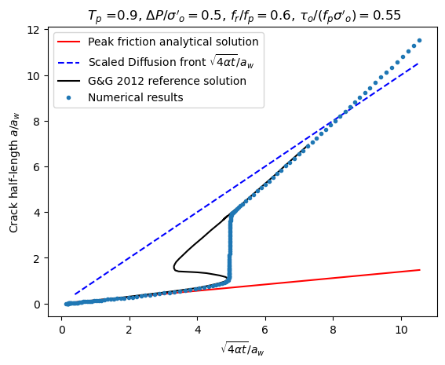
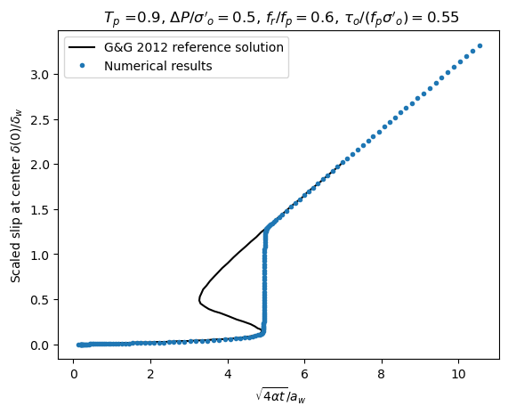
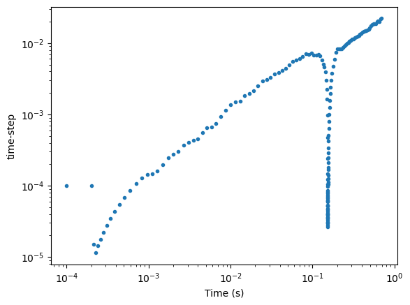

# 2D fluid-induced shear frictional rupture on a linear weakening planar fault

This example demonstrate the capability of the PyFracX code to reproduce the nucleation and arrest of an instability associated with fluid-injection into a planar fault with linear weakening friction.

The reference solution for this case can be found in the work of 
D. I. Garagash and L. N. Germanovich. 'Nucleation and arrest of dynamic slip on a pressurized fault'. *Journal of Geophysical Research: Solid Earth* (1978–2012), 117(B10), 2012.

The same benchmark was used in F. Ciardo, B. Lecampion, F. Fayard, and S. Chaillat. A fast boundary element based solver for localized inelastic deformations. *Int. J. Numer. Meth. Engng.*, 2020.

### Overview
The hydraulic properties of the fault are constant (and the medium is impermeable). Injection is performed at constant overpressure. Initially the fault is under-stressed with a ratio between the shear stress and initial peak strength of $\tau_o / (f_p \sigma^\prime_o) =0.55$ in the example investigated here. 
The strength of the injection is relatively weak compared to initial fault strength $\Delta p / (f_p \sigma'_o)=0.5 $, such that the intial slip activated in the so-called marginally pressurized regime with a fault stress injection parameter $T_p=0.9$. However, at the friction weakening, an instability occur as the fluid front is initially much ahead of the rupture front. Such a dynamic rupture is arrested when it catches up the fluid-front - the fault is stable under ambiant residual condition: $\tau_o < f_r \sigma^\prime_o $, as the friction residual friction is taken as $f_r /f_p =  0.6$  such that 
it needs further pressurization to continue propagating aseismically at residual friction. 

### Comparisons reference / PyfracX

A mesh with 2000 elements is used. The default adaptive time-stepping is used. 

We compare the evolution of crack length (scaled by the nucleation lengthscale $a_w$) as function of the ratio between the diffusion front over the nucleation lengthscale. 

Similarly, we also compare the evolution of the scaled peak-slip (located at the center where fluid is injected).

The results agree very well with both 1) the solution for the constant peak friction at early (see the constant friction example) and 2) the complete reference results from Garagash & Germanovich.

Note that in these figures the reference solution "goes" back in time during the instability. 

It is interesting to see that the solver adapt the time-step (reduce it) to capture the instability. 
This can be observed in the figure below where the value of the current time-step is plotted as function of time during the simulation. 

