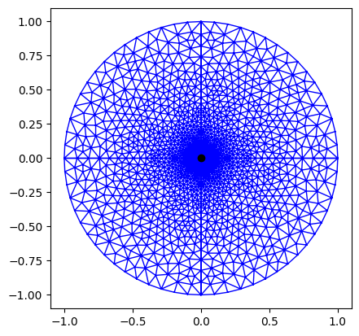
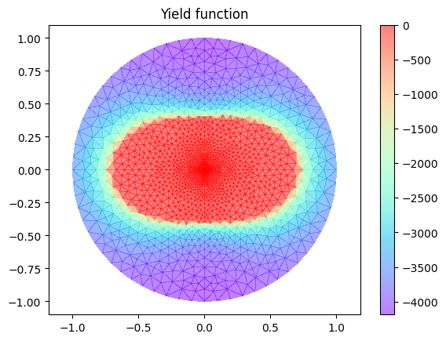
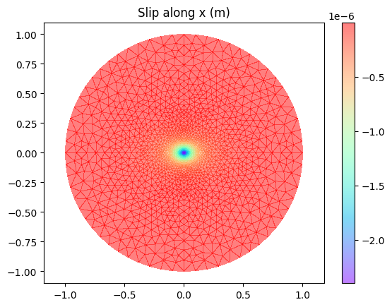

# 3D fluid-induced shear frictional rupture on a three-dimensional fault with constant friction

This example demonstrate the capability of the PyFracX code to simulate fluid-injection into a three-dimensional fault with constant friction coefficient.
The fault has a uniform initial stress state characterized by a normal stress $\sigma_o$ and shear stress $\tau_o$. it is assumed that fluid is injected at a point source at the center of the fault along the vertical axis. unlike the axisymmetric case, we can consider Poisson’s ratio to be other than zero, which denotes that the rupture profile is elliptical. The rock masses are considered to be impermeable signifying that there is no leak-off. The hydraulic
transmissivity of the fault is assumed to be constant and thus the flow happens only parallel to the fault plane.

The reference solution for $(\nu = 0)$ case can be found in the work of 
Alexis Sáez, Brice Lecampion, Pathikrit Bhattacharya, Robert C. Viesca,
Three-dimensional fluid-driven stable frictional ruptures,
Journal of the Mechanics and Physics of Solids,
Volume 160,
2022,
104754,
ISSN 0022-5096,
https://doi.org/10.1016/j.jmps.2021.104754.
(https://www.sciencedirect.com/science/article/pii/S0022509621003562)

### Overview
The hydraulic properties of the fault are constant (and the medium is impermeable). Injection is performed at a constant rate. The stress criticality of the fault is governed by two dimensionless parameters, poisson's ratio (\nu) and the stress-injection parameter T which is defined as, $ (f \sigma'_o - \tau_o) / (f \Delta p_*)$, where $\Delta p_*$ is the characteristic pressure defined as,
$\Delta p_* = (Q \eta) / (4 \pi k w_h)$. Here Q is the injection rate, $\eta$ is the dynamic viscosity of water, k is the intrinsic permeability and $w_h$ is the hydraulic aperature.

In the example investigated below, the fault is critically stressed with a T value of 0.01 and the value of poisson's ratio is taken to be 0.45. Fluid is induced at a constant injection rate of 0.03 $m^3/s$. The other parameters are mentioned in the script.

### Results

A mesh with 3504 triangular elements is used as shown in the figure below. The default adaptive time-stepping is used. 

The yield function is plotted in the figure below. It can be clearly seen that the  rupture front is elliptical.

We also plot the accumulated slip in the x-direction in the figure below 

