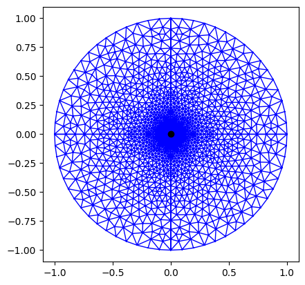

# 3D fluid-induced shear frictional rupture on a three-dimensional fault with slip-weakening friction

This example will demonstrate the capability of the solver to capture the evolution of slip in a slip-weakening fault and specifically its ability to capture the nucleation and arrest of the rupture front. The results will be verified against the results from: 

Alexis Sáez, Brice Lecampion,
Fluid-driven slow slip and earthquake nucleation on a slip-weakening circular fault,
Journal of the Mechanics and Physics of Solids,
Volume 183,
2024,
105506,
ISSN 0022-5096,
https://doi.org/10.1016/j.jmps.2023.105506.
(https://www.sciencedirect.com/science/article/pii/S0022509623003101)

The governing parameters of this problem are:

a) Pre-stress ratio or stress criticiality, $S = \tau'_o/(f_p \sigma'_o)$, 
b) Residual to Peak friction ratio, $F = f_r/f_p$, 
c) Overpressure ratio, $P = \Delta p_*/\sigma'_o$.

 Sáez & Lecampion (2023) demonstrates the map of rupture regimes for linear slip-weakening model. (R1) Unconditionally stable fault slip. (R2) Quasi-static slip up to the nucleation of a dynamic rupture, followed by arrest and then purely quasi-static slip. (R3) Quasi-static slip until the nucleation of a run-away dynamic rupture. (R4) Quasi-static slip up to the nucleation of a dynamic rupture, followed by arrest and then re-nucleation of a run-away dynamic rupture.:

### Mesh

A mesh with 3504 triangular elements is used as shown in the figure below. The default adaptive time-stepping is used. 

### Comparisons reference / PyfracX
The solver offers two evolution laws of slip-weakening friction: a) linear and b) exponential. Here we compare the results of the simulations with linear slip-weakening friction law and with poisson's ratio, $\nu$ = 0. The reference plots are from Figure 7 in Sáez & Lecampion (2023). 

S = 0.55, F = 0.7, P = 0.05, linear weakening

S = 0.6, F = 0.7, P = 0.035, linear weakening

From the figures, it is evident that the solver is closely reproducing the benchmark results. It is well capable of capturing exactly the instant of nucleation of a dynamic rupture as the friction weakens and as well as the arrest of the rupture as it catches up with the fluid front. However, the solver needs a very precise time stepping algorithm and a fine mesh to capture the instabilities in the rupture. In this simulation, we use 25660 elements with element size at the center as 0.0055m. The critical slip distance used is $d_c = 2e-04 m$.