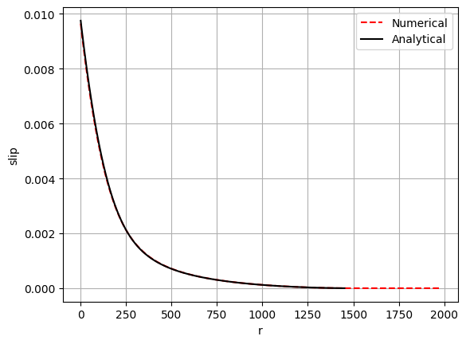
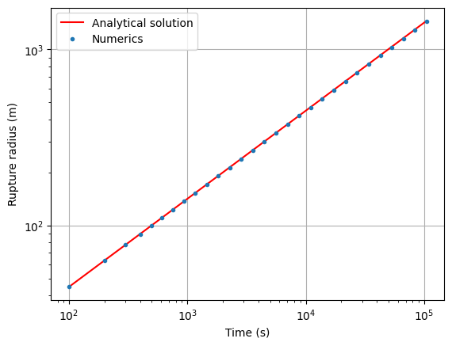
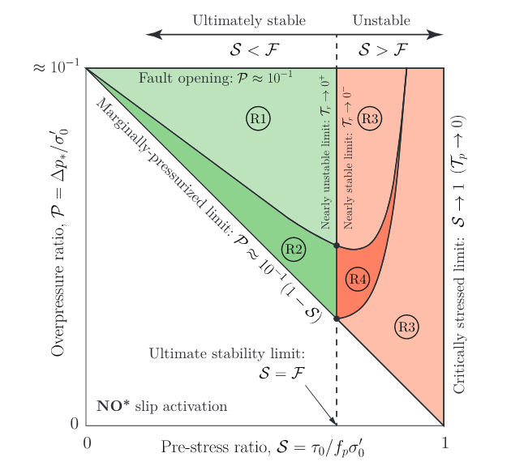
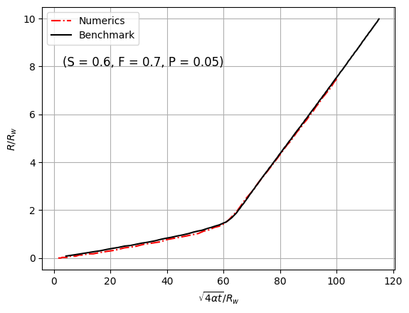
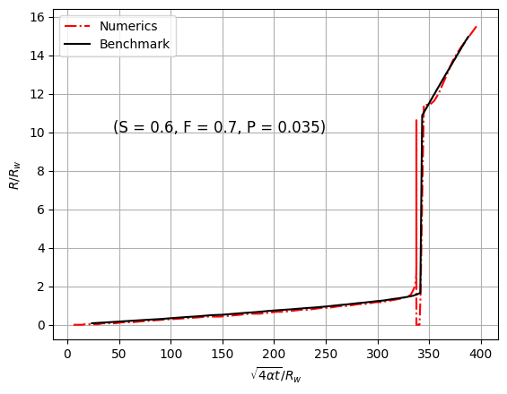

# 3D fluid-induced shear frictional rupture on a three-dimensional fault with constant friction (modelled as axisymmetric problem)

This example demonstrate the capability of the PyFracX code to simulate fluid-injection into a three-dimensional fault with constant friction coefficient.
The fault has a uniform initial stress state characterized by a normal stress $\sigma_o$ and shear stress $\tau_o$. it is assumed that fluid is injected at a point source at the center of the fault along the vertical axis. The fluid pressure diffusion is axisymmetric with respect to the injection axis. We consider Poisson’s ratio, ν = 0, which denotes that the rupture profile is circular. The rock masses are considered to be impermeable signifying that there is no leak-off. The hydraulic
transmissivity of the fault is assumed to be constant and thus the flow happens only parallel to the fault plane.

The reference solution for this case can be found in the work of 
Alexis Sáez, Brice Lecampion, Pathikrit Bhattacharya, Robert C. Viesca,
Three-dimensional fluid-driven stable frictional ruptures,
Journal of the Mechanics and Physics of Solids,
Volume 160,
2022,
104754,
ISSN 0022-5096,
https://doi.org/10.1016/j.jmps.2021.104754.
(https://www.sciencedirect.com/science/article/pii/S0022509621003562)

### Overview
The hydraulic properties of the fault are constant (and the medium is impermeable). Injection is performed at a constant rate. The stress criticality of the fault is governed by a dimensionless parameter called, the stress-injection parameter T which is defined as, $ (f \sigma'_o - \tau_o) / (f \Delta p_*)$, where $\Delta p_*$ is the characteristic pressure defined as,
$\Delta p_* = (Q \eta) / (4 \pi k w_h)$. Here Q is the injection rate, $\eta$ is the dynamic viscosity of water, k is the intrinsic permeability and $w_h$ is the hydraulic aperature.

In the example investigated below, the fault is critically stressed with a T value of 0.01. Fluid is induced at a constant injection rate of 0.03 $m^3/s$. The other parameters are mentioned in the script.

### Comparisons reference / PyfracX

A mesh with 3126 elements is used. The default adaptive time-stepping is used. 

We compare the slip profile of the fault with the analytical solution given by Viesca, Robert C. "Asymptotic solutions for self-similar fault slip induced by fluid injection at constant rate." arXiv preprint arXiv:2401.13828 (2024). 

Similarly, we also compare the evolution of the rupture radius with the analytical expression for the amplification factor given in Sáez & Lecampion (2022).

The results agree very well with both 1) the analytical solution for the slip profile and 2) the rupture radius obtained from the analytical expression.

# 3D fluid-induced shear frictional rupture on a three-dimensional fault with slip-weakening friction (modelled as axisymmetric problem)

This example will demonstrate the capability of the solver to capture the evolution of slip in a slip-weakening fault and specifically its ability to capture the nucleation and arrest of the rupture front. The results will be verified against the results from: 

Alexis Sáez, Brice Lecampion,
Fluid-driven slow slip and earthquake nucleation on a slip-weakening circular fault,
Journal of the Mechanics and Physics of Solids,
Volume 183,
2024,
105506,
ISSN 0022-5096,
https://doi.org/10.1016/j.jmps.2023.105506.
(https://www.sciencedirect.com/science/article/pii/S0022509623003101)

The governing parameters of this problem are:

a) Pre-stress ratio or stress criticiality, $S = \tau'_o/(f_p \sigma'_o)$, 
b) Residual to Peak friction ratio, $F = f_r/f_p$, 
c) Overpressure ratio, $P = \Delta p_*/\sigma'_o$.

 Sáez & Lecampion (2023) demonstrates the map of rupture regimes for linear slip-weakening model. (R1) Unconditionally stable fault slip. (R2) Quasi-static slip up to the nucleation of a dynamic rupture, followed by arrest and then purely quasi-static slip. (R3) Quasi-static slip until the nucleation of a run-away dynamic rupture. (R4) Quasi-static slip up to the nucleation of a dynamic rupture, followed by arrest and then re-nucleation of a run-away dynamic rupture.:

### Comparisons reference / PyfracX
The solver offers two evolution laws of slip-weakening friction: a) linear and b) exponential. Here we compare the results of the simulations with linear slip-weakening friction law. The reference plots are from Figure 7 in Sáez & Lecampion (2023). 

From the figures, it is evident that the solver is closely reproducing the benchmark results. It is well capable of capturing exactly the instant of nucleation of a dynamic rupture as the friction weakens and as well as the arrest of the rupture as it catches up with the fluid front. 