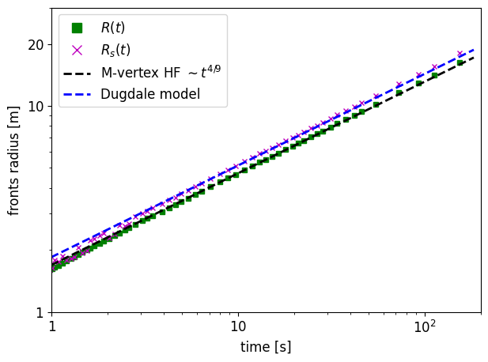
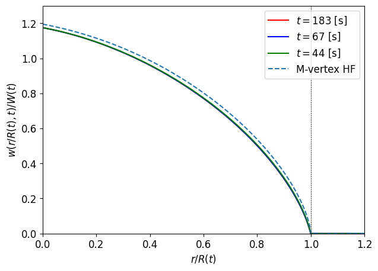
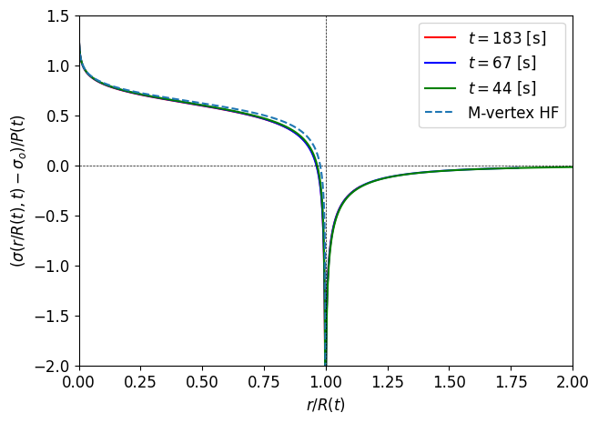
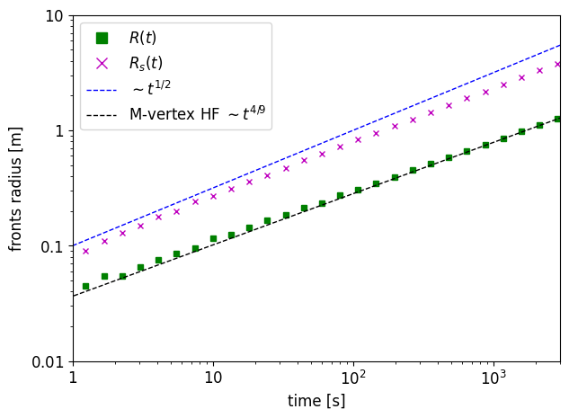
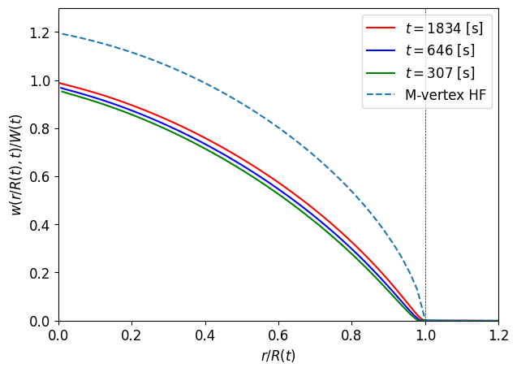
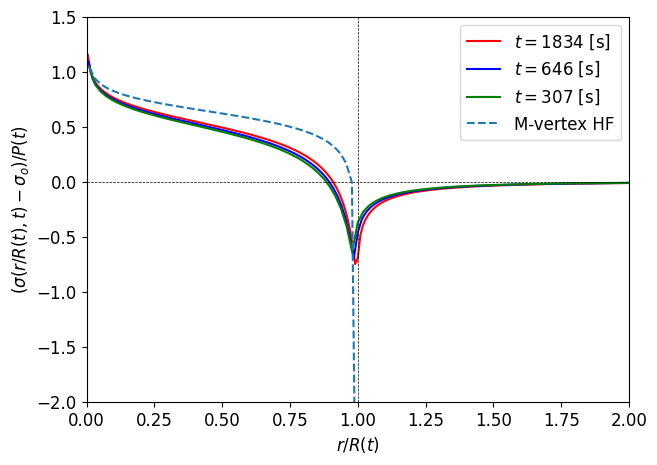

## Readme

### 1. M-vertex HF regime
#### Parameters
$$
\Delta p_c / \sigma_o^\prime = 1.2 \times 10^{6}
$$

$$
\tau_o / f \sigma_o^\prime = 0.4
$$
$$
\beta_s = 0.896
$$

#### Results

##### fronts vs time

##### opening profile

##### net pressure profile

### 2. Diffusion regime
#### Parameters
$$
\Delta p_c / \sigma_o^\prime = 1.2 \times 10^{1}
$$

$$
\tau_o / f \sigma_o^\prime = 0.4
$$
$$
\beta_s = 0.896
$$

#### Results

##### fronts vs time

##### opening profile

##### net pressure profile
